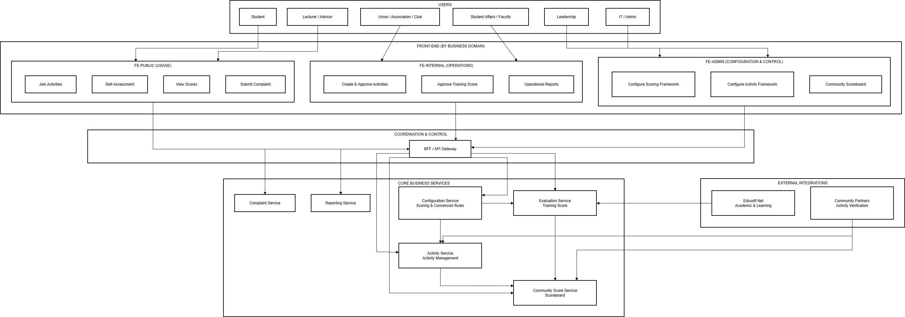

# AQ EduSAE — Student Activity & Conduct Scoring Portal

> **My Role:** Developer + intern team coordinator · AQ Tech · 2025
> **Team:** ~17 developers (mix of interns and junior devs)
> **Status:** In development
> **Original spec:** [`docs/BRD_SAE_v1.2.docx`](./docs/) *(Vietnamese, written by the team)*

---

## System Overview

AQ EduSAE is a student activity and conduct score management portal used by universities.

The system replaces a manual, end-of-semester self-reporting process where students submitted their conduct scores along with evidence files.

Previously this process generated **10,000+ uploaded files per semester**, creating a heavy verification burden for university staff.

The new platform introduces a structured workflow:

1. Universities define extracurricular activities
2. Students register for activities
3. Participation is recorded through attendance tools
4. Advisors monitor progress during the semester
5. Evaluation councils review and finalize conduct scores

The system follows the requirements defined in **Vietnamese MoET Circular 16/2015**.

---

## System Architecture

This diagram shows the high-level interaction between users, frontend applications, backend services, and external integrations.

---

## Key Features

- Activity planning
- Student participation tracking
- Evaluation workflow

---

## System Modules

The platform includes multiple modules supporting the full lifecycle of student activities and evaluation.

See full module structure:

docs/system-modules.md

**Bugs & Performance**
- Diagnosed and fixed a circular dependency between TanStack Store and API calls that was causing significant UI slowness

**Team coordination**
- Formally assigned to review intern PRs and break BRD specs down into dev tasks on this project

---

## Project Status

The system is currently **in development**.

Current implementation characteristics:

- Monorepo architecture
- React frontend + .NET backend
- SQL Server database
- No containerization yet

Future improvements planned by the team include:

- improved deployment automation
- infrastructure containerization
- further modularization of backend services

---

## My Contributions

### Frontend Development

- Built role-specific dashboards for six user types:
  - Students
  - Academic advisors
  - Homeroom teachers
  - Student affairs staff
  - Evaluation council members
  - System administrators

- Developed reusable UI components shared across dashboards:
  - data tables
  - form components
  - status badges
  - loading and skeleton states

- Implemented semester-based activity listing with paginated API fetching.

---

### System Integration

- Integrated EduSoft.NET API for academic-grade synchronization with conduct scoring workflows.

---

### Performance and Debugging

- Diagnosed and resolved a circular dependency between TanStack Store and API calls that caused significant UI performance issues.

---

### Team Coordination

- Reviewed intern pull requests.
- Helped translate BRD specifications into development tasks.
- Coordinated feature implementation across the intern development team.
**UI & Components**
- Reviewed intern pull requests.
- Translated BRD specifications into development tasks.
- Coordinated feature implementation across the intern development team.

**API Integration**

## External Integration

### EduSoft.NET API

The system integrates with the EduSoft student information system to synchronize academic results used in conduct score evaluation.

Integration responsibilities include:

- syncing student academic results
- mapping academic performance to conduct score criteria
- ensuring student academic status is available during evaluation

This integration reduces manual data entry and keeps the evaluation process consistent with official academic records.

---

## Technology Stack

Frontend
- React
- TypeScript
- TanStack Store

Backend
- C#
- .NET

Database
- Microsoft SQL Server

Infrastructure
- Monorepo architecture
- Azure DevOps for CI/CD
---

## Spec document

The BRD (`docs/BRD_SAE_v1.2.docx`) is the original Vietnamese requirements document written by the team. It covers the full business process design, feature list, and workflow specs that I implemented against.
